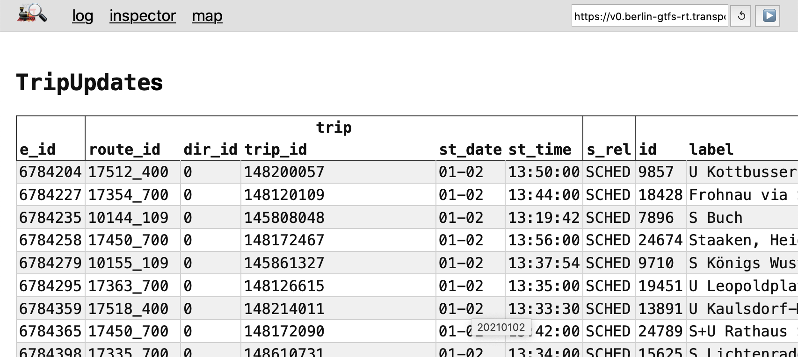
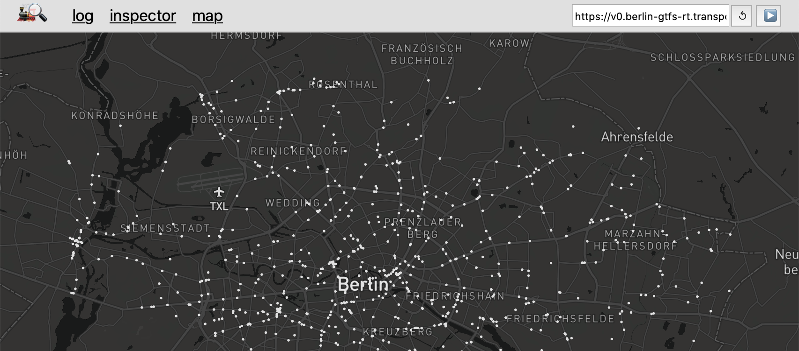

# gtfs-rt-inspector

**Web app to inspect & analyze any [CORS-enabled](https://enable-cors.org) [GTFS Realtime (GTFS-RT)](https://gtfs.org/reference/realtime/v2/) feed.**

It is deployed at [`public-transport.github.io/gtfs-rt-inspector/`](https://public-transport.github.io/gtfs-rt-inspector/).

*Note*: If your feed doesn't allow Browser-based access because it does not set [CORS](https://enable-cors.org) headers, as a workaround, you can run e.g. [`warp-cors`](https://github.com/Bassetts/warp-cors) locally to proxy it with CORS headers. (Do not deploy such a proxy to production if you don't know about the consequences!)

## supported URL parameters

URL parameter | description | default
-|-|-
`feedUrl` | URL of the GTFS-RT feed | –
`feedSyncStopped` | if the feed should be re-fetched periodically | `true`
`feedSyncInterval` | how often the feed should be re-fetched, in seconds | `30`
`view` | tab shown in the UI | `log`
`focusedTripId` | `trip_id` whose shape is highlighted on the map | –
`shapeIdsByTripIdUrl` | URL of the `trip_id` => `shape_id` JSON file, used for showing a vehicle's trip's shape on the map | `/shape-ids-by-trip-id.json`
`shapeUrl` | [URL template](https://tools.ietf.org/html/rfc6570) for a shape, used for showing a vehicle's trip's shape on the map | `/shapes/{shape_id}.geo.json`

## Contributing

If you have a question or need support using `gtfs-rt-inspector`, please double-check your code and setup first. If you think you have found a bug or want to propose a feature, use [the issues page](https://github.com/derhuerst/gtfs-rt-inspector/issues).
